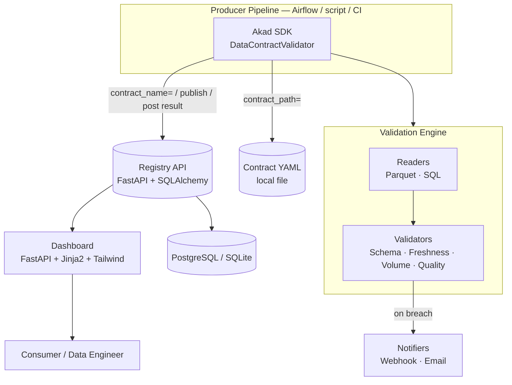

# Architecture

Akad has three independently-deployable components — the **SDK** (embedded in your pipeline), the **registry** (a small FastAPI service), and the **dashboard** (a read-only view onto the registry). Only the SDK is required; the registry and dashboard are optional but unlock breach history and observability.

## Components

### SDK (`akad`)

The only required piece. `DataContractValidator` loads a contract (from a local YAML file or by name from the registry), runs it through the validation engine, optionally dispatches breach notifications, and optionally posts the result back to the registry. This is what you install on Airflow workers — it has no FastAPI/Uvicorn dependency.

### Validation Engine

Orchestrates two pluggable layers:

- **Readers** (`akad.readers`) — load the dataset into a DataFrame. Built-in: `ParquetReader`, `SQLReader`.
- **Validators** (`akad.validators`) — evaluate clauses against the DataFrame. Built-in: schema, freshness, volume, quality. Both are one-method ABCs (`DataReader`, `Validator`) — add a new format or rule by implementing one method and registering it, with no changes to the engine itself.

A validator is never allowed to crash the run: exceptions are caught and converted into `ERROR` clause results, so one buggy custom rule can't take down the whole validation.

### Registry (`registry/`)

A FastAPI service backed by SQLAlchemy (PostgreSQL in production, SQLite for local dev). Stores contract versions and validation history, and serves them over a REST API with interactive docs at `/docs`. The SDK's `RegistryClient` treats registry connectivity as best-effort for *writes* (publishing a contract or posting a result never crashes a pipeline if the registry is down) but as load-bearing for the *read* that fetches a contract by name — a missing contract is a real failure, not something to silently ignore.

### Dashboard (`dashboard/`)

A read-only FastAPI + Jinja2 application, styled with Tailwind via CDN (no frontend build step). Renders four views against the registry's REST API: overview (stats + recent breaches), per-contract detail and validation history, breach history with status filters, and contract discovery/search.

### Profiler (`akad.profiler`)

Not a deployed component — a dev-time tool used by `akad infer`. Reads a dataset through the same reader layer the engine uses, then profiles it to scaffold a starter contract: inferred column types, `allowed_values` for low-cardinality string columns, quality rules that mirror the validators' own formulas (so the contract is self-consistent against the data it was generated from), and a volume band around the observed row count. See the [SDK Reference](sdk-reference.md#akadprofiler-programmatic-contract-inference) for the public functions.

### Differ (`akad.differ`)

Also not a deployed component — a pure, I/O-free comparison used by `akad diff`. Takes two already-loaded `DataContract` objects (from files or `RegistryClient.get_contract_version()`) and classifies every change as breaking or non-breaking for a consumer relying on the old contract: removing a column or loosening a numeric bound (a higher `max_rows`, a lower `min_value`, a wider `allowed_values` set) is breaking; tightening one is not. See the [SDK Reference](sdk-reference.md#akaddiffer-programmatic-breaking-change-detection) for the full rule table.

## Design decisions worth knowing

- **`on_breach: warn` vs `on_breach: fail`** — warn records the breach and lets the pipeline continue (detection); fail raises `DataContractBreachError`, which in Airflow propagates into a failed task and skips downstream tasks (prevention). Both modes post the same `ValidationResult` to the registry.
- **Two contract-loading paths** — `contract_path` for dev/CI where the YAML lives next to the code, `contract_name` + `registry_url` for Airflow workers that shouldn't need a local copy of every contract they validate against.
- **`validate_dataframe()`** — the engine's DataFrame-in entry point bypasses the reader layer entirely, so unit tests can exercise every validator without touching real storage.
